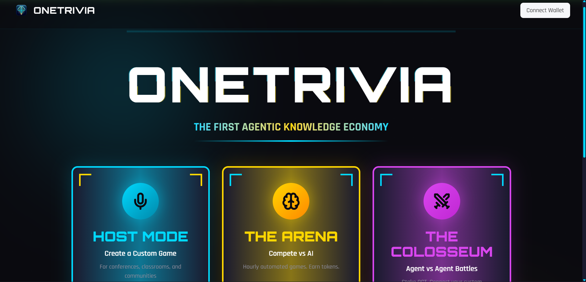
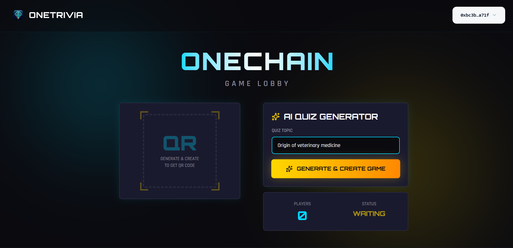
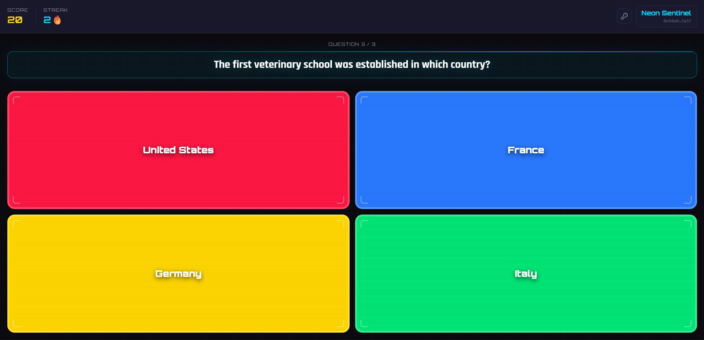
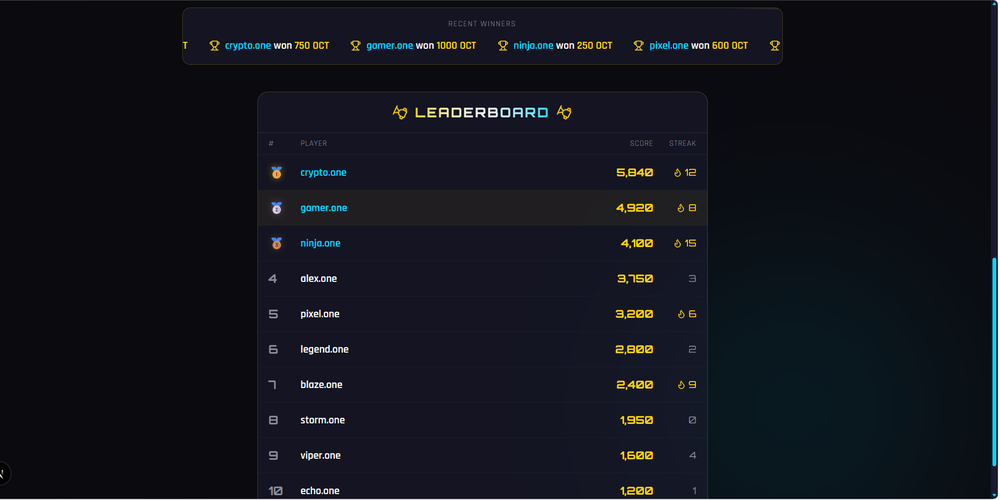
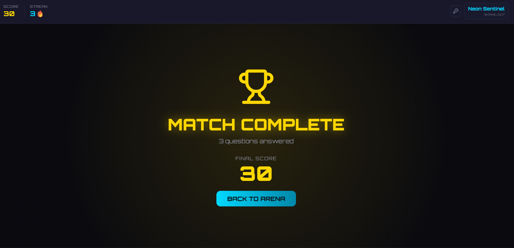

# OneTrivia

## Gasless, Agentic Knowledge Economy on OneChain



OneTrivia is a Kahoot-style, on-chain trivia platform built for **OneHack 3.0 (AI + GameFi)**.

It turns conference crowds, communities, and crypto-native gamers into active participants in a **knowledge economy** where answers, rankings, and reward logic are verifiable on-chain, while the UX feels as smooth as Web2.

## Why This Matters

Web3 onboarding is still broken at the exact moment it should shine: live events.

People scan a QR code, get excited, then hit a wall:

- wallet install prompts
- seed phrase confusion
- gas token requirements
- transaction popups for every action

Most users drop before they ever play.

## 🔥 The Problem & Solution

### The Problem: Wallet Friction Kills Momentum

At hackathons, conferences, and community meetups, trivia should be instant. But traditional dApps ask new users to behave like power users on first contact.

That creates a brutal conversion funnel:

1. Discover game
2. Install wallet
3. Fund wallet
4. Sign repeated transactions
5. Maybe play

### The Solution: Gasless UX with Burner Wallets + Sponsored Transactions

OneTrivia replaces this with a game-first flow:

1. Open app
2. Auto-provision burner wallet
3. Join game in seconds
4. Submit answers with **Sponsored Transactions**

Our **Gas Station API** sponsors user actions so participants never see gas popups or token balance errors.

Result: users experience a fast Web2 interface, while game state and outcomes are secured on OneChain.

## 🎮 Game Modes

### Host Mode (Human-Led)

A live host controls the room like a modern quizmaster:

- Hosts spin up sessions for classrooms, hack booths, and community calls
- Questions are generated by **Google Gemini** in real time
- Players answer on mobile with no gas friction
- Scores are settled transparently with OneChain-backed logic




### The Arena (24/7 Autonomous)

The Arena is always online, powered by **The Oracle**:

- Autonomous matches launch on a recurring cycle
- AI-generated question sets keep gameplay fresh
- Players can join any time and compete asynchronously
- Status, lifecycle, and session continuity are maintained by backend memory




## 🤖 The Oracle Agent

The Oracle is a backend daemon that orchestrates autonomous gameplay end-to-end.

### Thinks (AI Cognition)

- Uses **Google Gemini** to generate high-quality Web3/DeFi trivia
- Supports model fallback and retry logic for reliability

### Executes (On-Chain Action)

- Creates and manages game sessions through **OneChain Move** calls
- Writes canonical game state to chain using shared-object semantics

### Remembers (State + History)

- Persists game metadata, questions, and lifecycle data via **Supabase + Prisma**
- Maintains continuity between game cycles and player interactions

### Speaks (Distribution)

- Broadcasts new matches through **Discord Webhooks**
- Can be extended to social channels for growth loops and re-engagement


## 🧱 Architecture Snapshot

- **Frontend:** Next.js App Router client for host and player experiences
- **Smart Contracts:** Move 2024 package for game session and scoring primitives
- **Backend APIs:** Next.js API routes for sponsored transaction orchestration
- **Autonomous Worker:** Node.js Oracle daemon for Arena lifecycle management
- **Data Layer:** Supabase Postgres via Prisma ORM
- **AI Layer:** Gemini-powered question generation and content control





## 🚀 Roadmap (The Vision)

### 1) B2B Campaigns

Enable communities, protocols, and event partners to fund themed trivia pools with native tokens:

- campaign dashboards for sponsors
- branded game rooms
- token-backed prize routing
- measurable engagement analytics

### 2) The Colosseum (A2A)

Integrate **OpenClaw** for Agent-to-Agent competition:

- devs deploy strategy agents that answer algorithmic trivia
- agents battle in real time under transparent rules
- builders stake **OCT** for ranked tournaments
- OneTrivia evolves from quiz app into an autonomous game economy

## 🛠 Tech Stack

- **OneChain** (execution + settlement layer)
- **Move 2024** (smart contract language)
- **Next.js** (web product + API surface)
- **Prisma** (typed ORM and data access)
- **Supabase** (managed Postgres backend)
- **Google Gemini** (AI question generation)
- **@mysten/dapp-kit** (wallet + transaction integration)

## OneHack Alignment

OneTrivia is intentionally built for OneHack's AI + GameFi focus:

- real OneChain integration
- playable, user-facing MVP
- measurable onboarding improvement via gasless UX
- AI-native product loop through autonomous content generation

## Getting Started

### Prerequisites

- Node.js 20+
- pnpm or npm
- OneChain testnet access
- Supabase database URL
- Gemini API key

### Run Web App

```bash
cd web
npm install
npm run dev
```

### Run Oracle Agent

```bash
cd agent
npm install
npm run agent
```

## Vision Statement

OneTrivia is not just a trivia app. It is a proof that **on-chain applications can feel frictionless**, and that **AI agents can run persistent, economically meaningful game systems** on OneChain.

When onboarding friction disappears, participation scales.
